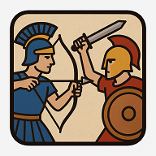

# Os Horácios e os Curiácios

Um jogo de estratégia em navegador inspirado na lendária batalha entre os Horácios e Curiácios. Este projeto foi desenvolvido para explorar conceitos de Inteligência Artificial e desenvolvimento de Progressive Web Apps (PWA).

## 🚀 Como Jogar

Você pode jogar o jogo diretamente no seu navegador através deste link:

**[Clique aqui para jogar](https://LuisCarlosEiras.github.io/HoraciosCuriaciosapp)** 

## Funcionalidades Principais

* Jogabilidade baseada em turnos contra uma Inteligência Artificial.
* IA com heurística para tomar decisões estratégicas, considerando ataques e riscos.
* Gráficos que mostram o histórico de partidas e a evolução do desempenho da IA.
* Pode ser instalado como um aplicativo (PWA) no seu celular ou computador para acesso offline.

## Tecnologias Utilizadas

* HTML5
* CSS3
* JavaScript (ES6+)
* [Chart.js](https://www.chartjs.org/) para a visualização de dados.
* Hospedado com [GitHub Pages](https://pages.github.com/).

## Tecnologias de IA 

### Etapa 1: Fase de Abertura Aleatória (Jogadas 1 a 7)
No início de cada partida (seja contra o jogador ou em modo de treinamento), a IA entra em uma fase de abertura programada para ser imprevisível.

Comportamento: Durante as suas sete primeiras jogadas, a IA não utiliza seu motor de avaliação estratégica. Em vez disso, ela identifica todos os movimentos legalmente possíveis para todas as suas peças no tabuleiro e seleciona um de forma completamente aleatória.

Propósito: Esta fase introduz uma variabilidade significativa no início do jogo, forçando a IA a não repetir sempre as mesmas aberturas e a se adaptar a uma gama maior de cenários a partir da oitava jogada.

### Etapa 2: Ativação da IA Estratégica (A partir da 8ª Jogada)
Após a sétima jogada, a IA transiciona do modo aleatório para seu comportamento estratégico principal, que é dividido em duas sub-etapas: a avaliação padrão e um modo emergencial.

A. Avaliação Padrão de Jogada (avaliarJogada): O núcleo da IA calcula um "placar" para cada movimento possível, considerando:

Capturas: Principal prioridade, com pontuações maiores para peças mais valiosas (Arqueiro > Espadachim > Lança).

Posicionamento: Incentiva o avanço em direção ao lado inimigo e o controle das colunas centrais.

Análise de Risco: Penaliza movimentos para casas que estão sob ameaça de ataque do adversário, tentando preservar suas próprias peças.

B. Estratégia de Fuga (Comportamento Emergencial): Uma lógica de sobrevivência é acionada se duas condições forem atendidas simultaneamente: mais de 50 jogos totais já foram registrados e os Curiácios possuem 3 ou menos peças. Neste modo, a IA ignora a maioria das considerações ofensivas e prioriza mover suas peças para locais seguros, longe das ameaças inimigas.

### 3: Condição de Paz por Inatividade (Monitoramento Contínuo)
Esta é uma nova regra global que pode encerrar o jogo a qualquer momento.

Mecanismo: Um contador específico (curiacioPazCounter) monitora exclusivamente os movimentos dos Curiácios.

Lógica do Contador:

Se um Curiácio realiza um movimento de captura contra um Horácio, o contador é zerado.

Se um Curiácio se move para uma casa vazia ou realiza um movimento que não resulta em captura, o contador é incrementado.

Os movimentos dos Horácios não afetam este contador.

Resultado: Se o contador atingir o valor 15, o jogo é imediatamente encerrado e o resultado é declarado como "Paz foi alcançada" (empate).

### Etapa 4: Treinamento e Evolução

O botão "Treinar os Curiácios" continua a simular partidas em alta velocidade, mas seu processo agora incorpora as novas regras. Os jogos simulados começarão com 7 jogadas aleatórias e poderão terminar prematuramente devido à nova condição de paz. Isso significa que o histórico de resultados, que alimenta os gráficos de desempenho e a ativação da "Estratégia de Fuga", é construído a partir de cenários de jogo mais complexos e variados.

*Desenvolvido por Luís Carlos Silva Eiras.*
